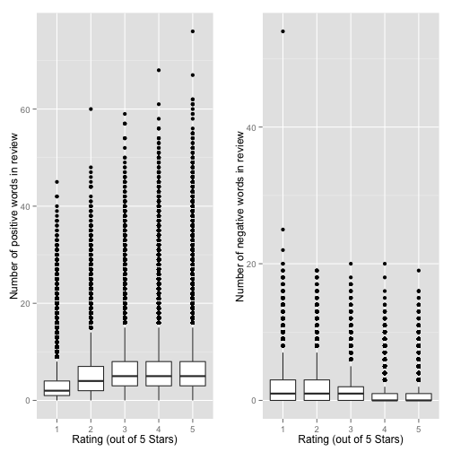

JHU-MachineLearning-Capstone-Presentation
========================================================
author: Sean Clarke 
date: 

Study Motivation
========================================================

***

* _Is it possible to predict the number of stars given to a business based on analysis of the text in a Yelp review?_
* _Is the accuracy of the model affected by language, for example does it work less effectively in Germany?_ 
* _Given the fact that Spanish is increasingly becoming the language of the US, is that important in answering this question?_

Exploratory Analysis
========================================================

 

***

* We see that our thesis that low scoring reviews tend to have less positive words and more negative words in the review (and the converse for high scoring reviews) has some truth.
* However there are also clearly some huge outliers!
* It appears that this thesis is at the very least a decent place to start from when modelling.

Methodology
========================================================

* Data split into Training, Validation and Test sets in a 60/20/20 ratio.
* Text from reviews processed into a "bag of words" representation using the tm Text Mining Framework.
* Lists of positive and negative words from [Hiu and Lu]( http://www.cs.uic.edu/~liub/FBS/sentiment-analysis.html) used to evaluate the number pf positive and negative words used per review.
* Model built modelling n(stars) ~ n(+ve words) + n(-ve words) + n(words)
* Comparison of in and out of sample errors using training and validation datasets led to choice of ctree based model.

Question - Can we predict Yelp Star Ratings from Review text?
========================================================

|   | %Predicted| RMS Error|
|:--|----------:|---------:|
|NA |  40.404540|  1.391928|
|CA |  39.833248|  1.375968|
|UK |  37.438381|  1.338695|
|DE |   1.165931|  2.275953|

* The answer from this work is yes, to a certain extent we can even with a simple model.
* Success rate of approximately 40% for English speaking countries.
* Model assigning random scores would be expected to achieve 20% success rate.
* Can probably do better using Ngrams instead of single words.

Question - Is Language Important?
========================================================

 

***

* The sentiment analysis model employed has this dependency baked in as the word lists only contain English words.
* Its clear that the model doesnt work in Germany.
* The US hispanic population doesnt appear to affect efficacy - more analysis needed.
* Not able to answer this question fully - model language specific.

